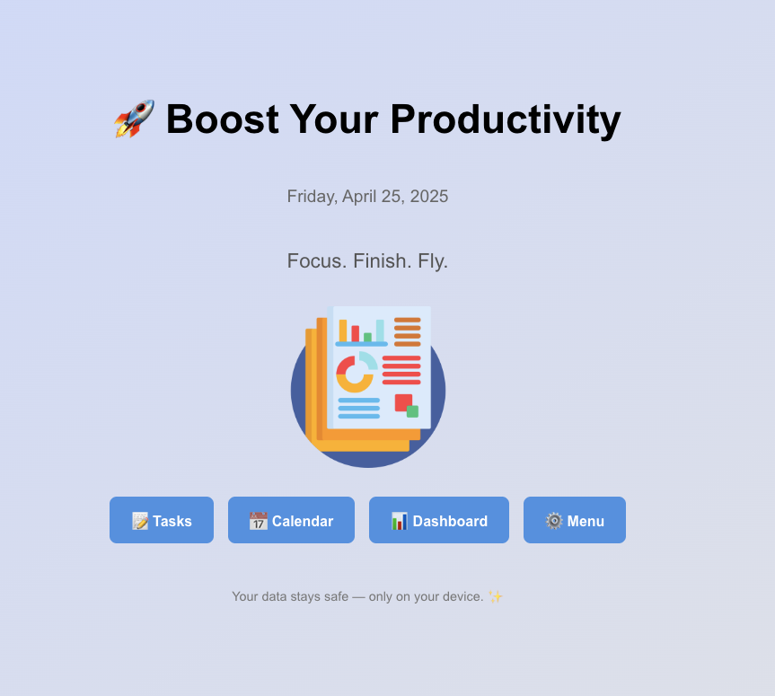
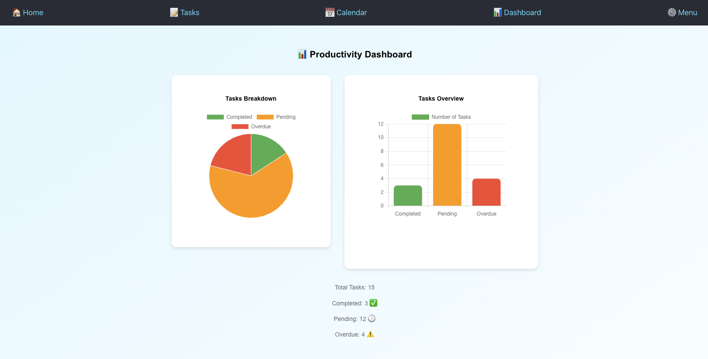

# 📋 Personal Productivity App

> **Offline Task Manager + Calendar + Dashboard + Voice Assistant — All without Cloud Sync!**

---

## 🧠 Overview

A modern, offline-first **Personal Productivity Web App** designed for a **single user on a single device**.  
Manage daily tasks, visualize schedules with a built-in calendar, track productivity trends with dynamic dashboards, and control everything — without internet or login!

---

## 🚀 Features

- **Task Management**  
  ➔ Add, edit (inline), delete, and mark tasks as complete.  
  ➔ Assign due dates and track overdue tasks.  
  ➔ Filter tasks (Pending / Completed / Overdue / All) and search easily.

- **Calendar Integration**  
  ➔ Built-in monthly calendar (FullCalendar React).  
  ➔ Add tasks by clicking dates.  
  ➔ Color-coded tasks: Green (Completed), Red (Pending).

- **Dashboard Analytics**  
  ➔ **Pie Chart** for Completed vs Pending tasks.  
  ➔ **Bar Chart** showing Daily task completions.

- **Voice Command Integration**  
  ➔ Add, complete, and delete tasks using **Voice Assistant** (Web Speech API).

- **Menu & Settings**  
  ➔ Light/Dark mode toggle.  
  ➔ Background style switcher (soft gradients).  
  ➔ Export tasks to `.json` file.  
  ➔ Import tasks from backup file.  
  ➔ View Local Storage usage.  
  ➔ Dynamically change app title.  
  ➔ Full Factory Reset option.

- **Offline-Ready (PWA Principles)**  
  ➔ Works fully without internet after first load.  
  ➔ No user authentication — your data stays 100% private inside your browser.
  
  ---

## Voice Command Examples

-  ➕ "add task call my friend"

-  ✅ "mark task 2"

-  ❌ "delete task 4"

-  🎯 "show completed tasks"

-  🧹 "clear all tasks"

---

## 🛠️ Tech Stack

- **React.js**
- **React Router DOM**
- **FullCalendar React**
- **Chart.js** (via react-chartjs-2)
- **LocalStorage API**
- **Web Speech API** (Voice Recognition)
- **Blob & FileReader APIs**
- **Progressive Web App Architecture**

---

## 📦 Installation

```bash
git clone https://github.com/YOUR-USERNAME/personal-productivity-app.git
cd personal-productivity-app
npm install
npm start
```

✅ Open [http://localhost:3000](http://localhost:3000) to view it in your browser.

---

## ✨ Demo Screenshots

| Home Page | Calendar View | Dashboard | task page |
|:---:|:---:|:---:|:---:|
|  |  |  |  |

---

## 📜 License

This project is open-source for educational and personal use.  
Built with ❤️ by Jaswanth.

---

# 🚀 Done!

---
